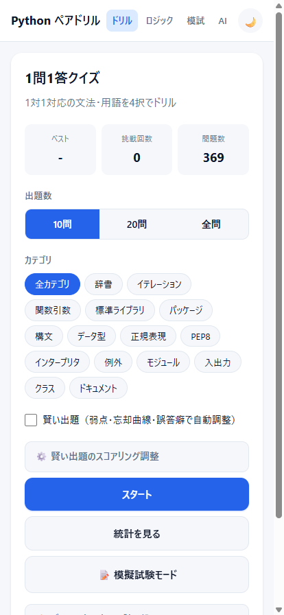
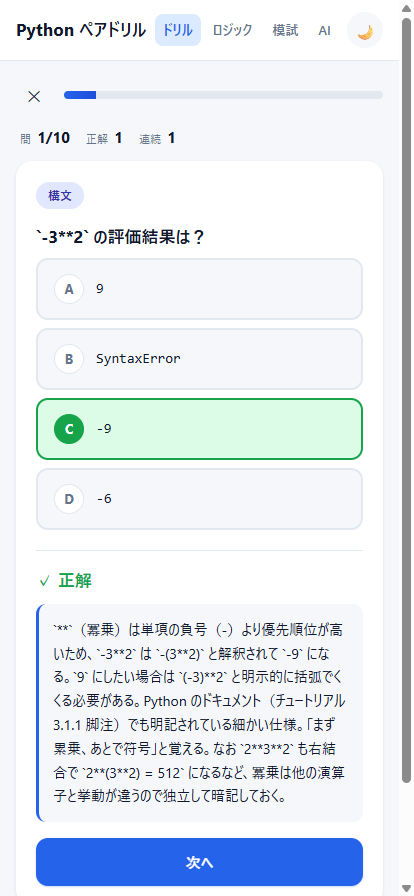
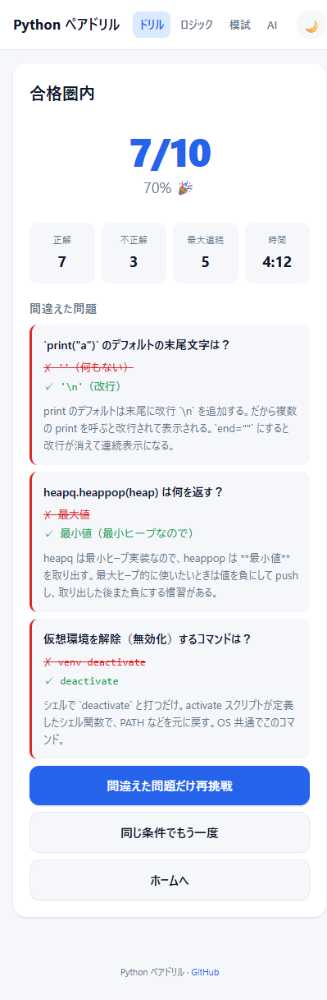
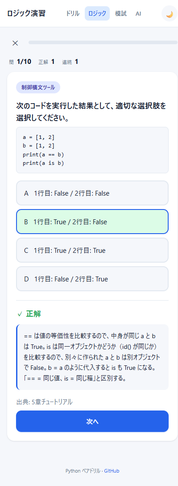
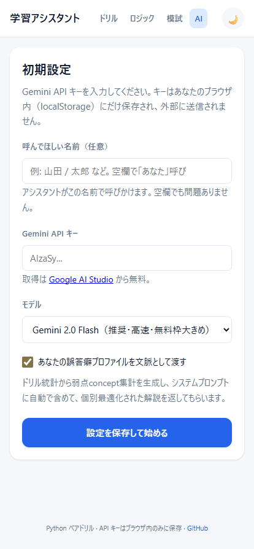
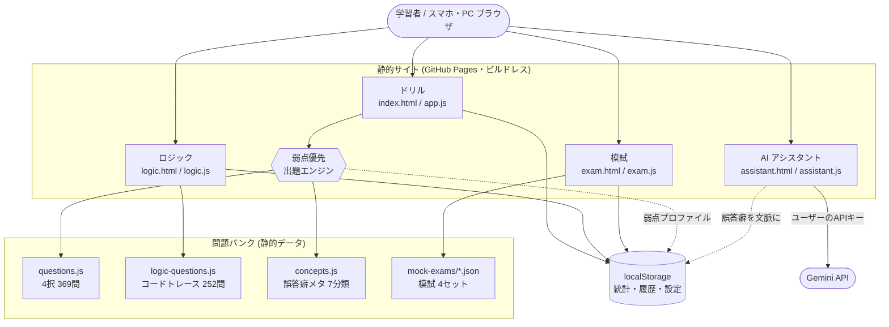
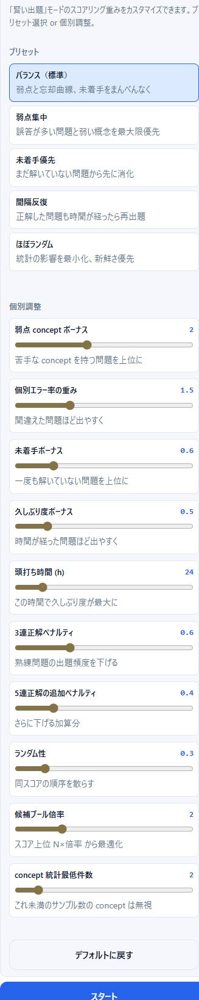

<div align="center">

# Python ペアドリル

**Python3 エンジニア認定基礎試験を、すき間時間にスマホで反復する学習アプリ**

4択ドリル · コードトレース演習 · 模擬試験 · AI 学習アシスタント · 弱点優先出題

[](https://tatsunoritojo.github.io/python-pair-drill/)
[](https://tatsunoritojo.github.io/python-pair-drill/manifest.json)
-f7df1e?style=flat-square)


**▶ [https://tatsunoritojo.github.io/python-pair-drill/](https://tatsunoritojo.github.io/python-pair-drill/)**

</div>

---

> ビルド工程ゼロの純粋な静的サイト。学習履歴・統計・設定は端末の localStorage に保存し、専用サーバを持たない（AI 機能を使うときだけ、利用者自身のキーで Gemini API を呼ぶ）。
> 「知っているか・知らないか」で得点が決まる暗記寄りの設問を、ドリルモードでは弱点・経過時間・誤答癖から自動で出題調整する。

## 目次

- [何を解決するか](#何を解決するか)
- [スクリーンショット](#スクリーンショット)
- [主な機能](#主な機能)
- [システム全体像](#システム全体像)
- [弱点優先出題エンジン](#弱点優先出題エンジン)
- [技術スタック](#技術スタック)
- [リポジトリ構成](#リポジトリ構成)
- [クイックスタート](#クイックスタート)
- [運用ステータスとプライバシー](#運用ステータスとプライバシー)
- [ライセンス](#ライセンス)

---

## 何を解決するか

| 課題 | このアプリの解決 |
|---|---|
| 文法・組み込み関数・型など「1対1対応」の暗記項目を反復する手段が少ない | 4択 + 即時フィードバックで、すき間時間に何度でも回せる |
| 自分がどこで間違えやすいか把握しづらい | 誤答癖を7分類で集計し、弱点を重み付けして自動出題する |
| 参考書だけではコードの実行結果を予測する力が鍛えにくい | 模擬演習から抽出したコードトレース専用モードを用意 |
| 解説を読んでも「なぜ間違えたか」が腹落ちしない | 自分の誤答癖を文脈に渡し、AI が個別最適化した解説を返す |

## スクリーンショット

<div align="center">

| ドリル（出題設定） | 回答と即時フィードバック | 結果と弱点復習 |
|:---:|:---:|:---:|
|  |  |  |

| コードトレース演習 | AI 学習アシスタント |
|:---:|:---:|
|  |  |

</div>

## 主な機能

4つのモードで構成される。ナビゲーションから随時切り替えられる。

- **ドリル**（`index.html`） — 4択クイズ **369問** / 15カテゴリ。選択肢順・出題順をランダムシャッフルし、即時フィードバックと解説を表示。出題数（10/20/全問）とカテゴリを絞り込める。
- **ロジック**（`logic.html`） — コードトレース演習 **252問** / 11ドメイン。Python コードを読んで実行結果を予測する設問に特化。模擬演習1〜4から抽出。任意で「過去の不正解率で重み付け」した出題も選べる。
- **模試**（`exam.html`） — `mock-exams/*.json` を読み込み、本番形式（問題数・時間制限）で通し練習する模擬試験モード（**4セット**）。
- **AI**（`assistant.html`） — Gemini API を使った学習アシスタント。設定で有効化しており、かつドリル統計が十分あれば、あなたの誤答癖プロファイルをシステムプロンプトに含めて個別最適化した解説を返す。API キーは利用者自身が用意する。

横断的な機能:

- **弱点優先出題** — 後述の出題エンジンによる自動調整
- **統計・履歴** — 問題別の正答率、ベストスコア、挑戦回数を localStorage に保存
- **間違えた問題だけ再挑戦** — 結果画面から誤答のみを再出題
- **ライト / ダークテーマ切替**
- **キーボードショートカット** — `1`–`4` / `A`–`D` で選択、`Enter` / `Space` で次へ
- **データの書き出し / 読み込み** — 統計を JSON でバックアップ・移行
- **PWA** — ホーム画面に追加してスタンドアロン起動（`manifest.json`）

## システム全体像



## 弱点優先出題エンジン

**ドリルモードの中核**（`app.js`）。「賢い出題」を有効にすると、単純なランダムではなく、学習者ごとの状態に応じてスコアリングした重み付き抽選で出題する。アプリ UI ではこの仕組みを「弱点・忘却曲線・誤答癖で自動調整」と表記している。

（ロジックモードにも弱点モードはあるが、そちらは「過去の不正解率 + ランダム」の単純な重み付けで、以下のフルスコアリングはドリルモード専用。）

**何を見るか**

- **誤答癖プロファイル** — 全問に付与した7分類のタグ（推測しがち / 語順 / 存在しない値 / 境界追跡 / 対の取り違え / 暗黙ルール / 文字列・正規表現）を、過去の正誤履歴から concept 別エラー率として集計
- **個別エラー率** — 問題ごとの不正解率
- **久しぶり度（経過時間補正）** — 最後に解いてからの経過時間に応じてボーナスを加算し、一定時間で頭打ちにする（久しぶりの問題ほど浮上）
- **未着手ボーナス** — 一度も解いていない問題を優先
- **連続正解ペナルティ** — 習熟した問題の出題頻度を下げる

**どう調整するか**

プリセット（バランス / 弱点集中 / 未着手優先 / 間隔反復 / ほぼランダム）をワンタップで切り替えられるほか、10項目のスコアリング重みを個別にチューニングできる。

<div align="center">

</div>

> 実装は `app.js` のスコアリング定義（`SCORING_PRESETS` / `SCORING_FIELDS`）と出題ロジックを参照。

## 技術スタック

| レイヤー | 採用技術 | 採用理由 |
|---|---|---|
| 言語 | HTML / CSS / Vanilla JavaScript | 学習ツールに必要な機能はフレームワーク無しで十分。依存ゼロで腐りにくい |
| ビルド | なし | `index.html` を開くだけで動く。CI もバンドラも不要 |
| 永続化 | localStorage | サーバを持たず、統計・履歴・設定を端末内に完結させる |
| 配信 | GitHub Pages | リポジトリへの push がそのままデプロイ。`.nojekyll` で素の静的配信 |
| インストール | PWA（`manifest.json`） | ホーム画面に追加してネイティブアプリのように起動 |
| AI 連携 | Gemini API（`gemini-2.0-flash` ほか） | 無料枠が大きく軽量。キーは利用者のブラウザ内のみに保持 |
| 問題データ | JavaScript 配列 / JSON | ビルド不要でそのまま読み込める。`QUESTIONS` 配列に追記するだけで増やせる |

## リポジトリ構成

```
python-pair-drill/
├── index.html / app.js          ドリルモード（メインのクイズロジック）
├── logic.html / logic.js        ロジック（コードトレース）モード
├── exam.html  / exam.js         模擬試験モード
├── assistant.html / assistant.js  AI 学習アシスタント（Gemini API）
├── style.css                    全画面共通スタイル（ライト/ダーク対応）
│
├── questions.js                 4択問題データ（QUESTIONS 配列・369問）
├── logic-questions.js           コードトレース問題（LOGIC_QUESTIONS・252問）
├── concepts.js                  難易度・誤答癖メタ（QUESTION_META・7分類）
├── mock-exams/                  模試データ（mock-exam-1〜4.json）
│
├── manifest.json                PWA マニフェスト
├── favicon.svg / *.png          アイコン・OG 画像
├── sitemap.xml / robots.txt / .nojekyll   配信・SEO 設定
│
└── docs/
    ├── 01-overview.md           1ページ概要
    ├── decisions/               設計判断の記録（ADR）
    └── screenshots/             本 README 用スクリーンショット
```

## クイックスタート

ビルド不要。クローンして `index.html` を開くだけで動く。

```bash
git clone https://github.com/tatsunoritojo/python-pair-drill.git
cd python-pair-drill

# ブラウザで直接開く（macOS なら open、Windows なら start）
start index.html
```

> 模擬試験モード（`exam.html`）は `mock-exams/*.json` を `fetch` で読み込むため、`file://` だと CORS で失敗する。
> 模試まで確認したい場合は簡易サーバ経由で開く（例: `python -m http.server`）か、公開版を使う。

公開版は GitHub Pages で配信している: **https://tatsunoritojo.github.io/python-pair-drill/**

### 問題を追加する

`questions.js` の `QUESTIONS` 配列に追記する。

```js
{
  id: 'unique-id',              // localStorage の統計キー（重複・変更は禁止）
  category: 'カテゴリ名',
  question: '問題文',
  choices: ['正解', '誤答1', '誤答2', '誤答3'],
  correct: 0,                   // choices 内の正解インデックス（実行時にシャッフルされる）
  explanation: '解説',
}
```

`id` は統計の保存キーになるため、**重複させない・既存 id は変更しない**（既存ユーザーの統計が壊れる）。

## 運用ステータスとプライバシー

- **ステータス**: active（GitHub Pages で公開中。問題の追加を継続中）
- **データの所在**: 学習履歴・統計と本体設定は端末の localStorage に保存する（API キーは下記のとおり別扱い）。クイズ機能（ドリル / ロジック / 模試）は専用サーバを持たず、これらを外部に送信しない
- **AI 用 API キーの扱い**: 利用者自身の Gemini API キーを使う BYOK 方式。既定では端末に保存するが、設定の「このブラウザにキーを保存する」をオフにすると、タブを閉じるまでの一時保存（sessionStorage）になる（共有端末向け）。キーは送信時に URL ではなくリクエストヘッダーに載せる
- **AI アシスタント利用時のみ**: 保存したキーで Google の Gemini API にリクエストする。このとき入力内容と（有効化かつ統計があれば）誤答癖プロファイルが Google に送信される

## ライセンス

MIT
